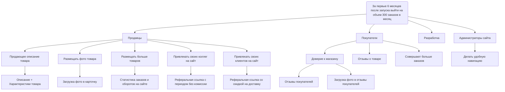

---
tags:
  - Саморазвитие
  - системный_анализ
  - конспект
created_at: 2025-11-19
updated_at: 2025-11-19
finished_at: 2025-11-28T21:41:00
---
# 3.4 Практика
В предыдущих заданиях вы уже сформулировали первые бизнес-/пользовательские требования, а теперь настало время закрепить навыки **концептуального проектирования** и **постановки бизнес-целей** (в том числе с помощью **Impact Mapping**).

## Практическое задание: «Онлайн-магазин авторских сувениров»

### Задачи

1. **Сформулировать чёткую бизнес-цель** (по SMART или OKR)
    
    - Перепроверьте, насколько конкретна ваша предыдущая формулировка целей.
    - Если нужно, уточните её, сделайте **измеримой** и **ограниченной по времени**.
    - (Опционально) Можно оформить цель в формате **OKR**: написать вдохновляющее “Objective” и 2–3 “Key Results” с конкретными цифрами.
2. **Составить Impact Map** (упрощённо)
    
    - **Goal**: возьмите ту, что только что сформулировали (по SMART/OKR).
    - **Акторы** (Actors): обозначьте основные группы (например, покупатели, мастера-продавцы, администратор/маркетинг).
    - **Impacts**: для каждого актора пропишите, **какое поведение** или **какие изменения** нам нужны, чтобы достичь цели (например, «Покупатели → совершают больше заказов, доверяют магазину», «Мастера → выкладывают новые товары регулярно», «Администратор → запускает акции и промо» и т.д.).
    - **Deliverables**: какие фичи (конкретные функциональные блоки, сервисы, инструменты) помогут создать нужное поведение? (Например, «Упрощённая форма заказа», «Отправка e-mail-уведомлений мастеру о новых заказах», «Программа лояльности» и т.п.)
3. **Опишите концептуально** (в 1–2 абзацах), как эти фичи сочетаются в **общей структуре**
    
    - Не углубляйтесь в детали реализации — достаточно упомянуть, что у нас есть «модуль витрины товаров», «модуль заказа», «модуль личного кабинета для мастера», «админ-панель» и т.д.
    - Коротко укажите, **зачем** нужен каждый модуль и как он помогает реализовать бизнес-цель.

### Формат сдачи

- Можно оформлять **Impact Map** как текстовый список или нарисовать дерево (например, в Miro).
- SMART/OKR-цель должна быть записана максимально ясно.
- Краткое текстовое резюме (**1–2 абзаца**) должно пояснить общий «скелет» концепции: какие ключевые модули мы видим и почему они важны для цели.

Пример решения на следующем слайде, не переключайте до того, как выполните задание!

---
## Мое решение
