### **Основы Mermaid.js**

Mermaid.js — это текстовый язык для создания диаграмм, который можно использовать прямо в Markdown и в VS Code. Он удобен для моделирования процессов, связей и экосистем.

---

## **1. Установка и использование в VS Code**

- **В VS Code** можно рендерить диаграммы через расширение [Markdown Preview Mermaid Support](https://marketplace.visualstudio.com/items?itemName=bierner.markdown-mermaid).
- В файле `.md` можно вставить Mermaid-код и просматривать его в режиме предварительного просмотра.

---

## **2. Основные типы диаграмм**

### **2.1. Блок-схемы (Flowchart)**

Используются для описания последовательностей и связей между элементами.

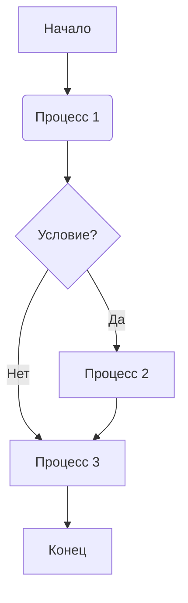

📌 **Обозначения:**

- `[]` — прямоугольник (A, F).
- `()` — скругленный блок (B).
- `{}` — ромб (C, условие).
- `-->` — обычная стрелка.
- `-->|Текст|` — стрелка с подписью.

---

### **2.2. Диаграмма последовательности (Sequence Diagram)**

Используется для моделирования взаимодействия между компонентами.

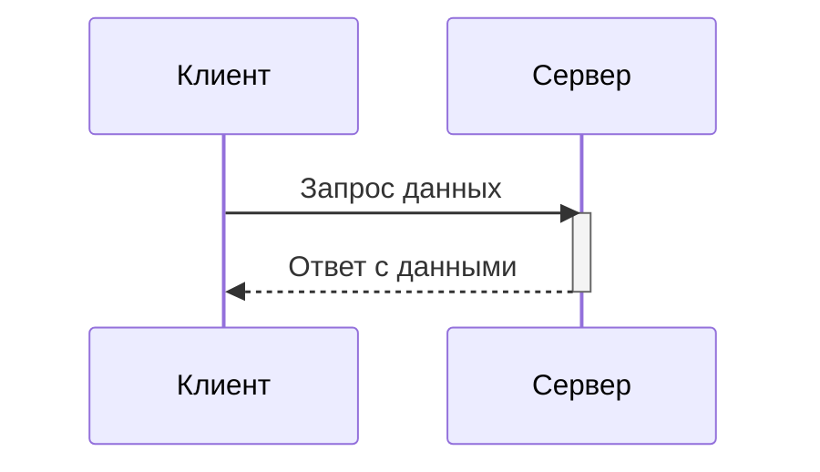

📌 **Обозначения:**

- `participant` — участник взаимодействия.
- `->>` — отправка сообщения.
- `-->>` — ответное сообщение.
- `activate/deactivate` — активация/деактивация процесса.

---

### **2.3. Диаграмма классов (Class Diagram)**

Используется для описания структур данных в ООП.

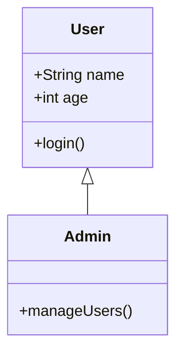

📌 **Обозначения:**

- `class <Имя>` — объявление класса.
- `+` (публичный) / `-` (приватный) / `#` (protected) — модификаторы доступа.
- `<|--` — наследование.

---

### **2.4. Диаграмма состояний (State Diagram)**

Используется для моделирования состояний объекта.

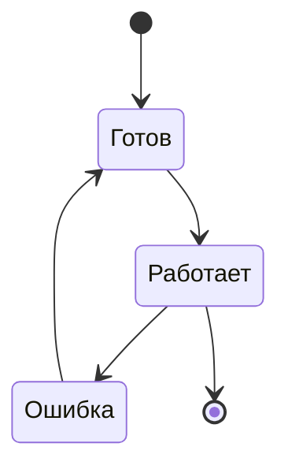

📌 **Обозначения:**

- `[ * ]` — начальное и конечное состояние.
- `-->` — переходы между состояниями.

---

### **3. Вложенные графы**

Можно группировать элементы с помощью `subgraph`.

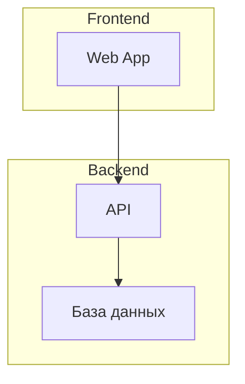

📌 **Использование `subgraph`** помогает структурировать сложные диаграммы.

---

## **4. Полезные настройки**

В Mermaid можно задавать стили и кастомизировать диаграммы.

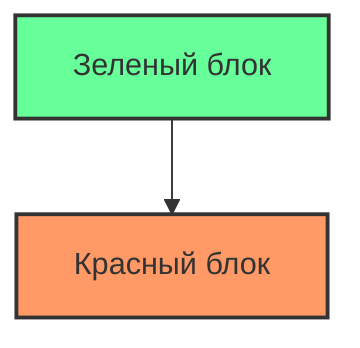

📌 **Использование `classDef`** позволяет стилизовать блоки.

---

## **Вывод**

- **Mermaid.js удобен** для визуализации процессов, архитектуры и экосистем.
- **Можно использовать в VS Code** без сложной установки.
- **Гибкость**: поддерживает диаграммы потоков, последовательностей, классов, состояний и др.

### **Типы диаграмм в Mermaid.js**

Mermaid поддерживает несколько типов диаграмм, каждая из которых подходит для разных задач.

---

### **1. Flowchart (Граф, блок-схема)**

Используется для визуализации процессов, алгоритмов и связей между компонентами.

📌 **Пример**:

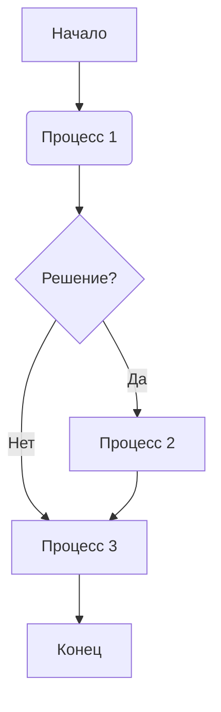

🔹 **Обозначения**:

- `[]` — прямоугольник (A, F).
- `()` — скругленный блок (B).
- `{}` — ромб для условий (C).
- `-->` — стрелка связи.
- `-->|Текст|` — стрелка с подписью.

---

### **2. Sequence Diagram (Диаграмма последовательностей)**

Используется для моделирования взаимодействия между объектами.

📌 **Пример**:


🔹 **Обозначения**:

- `participant` — участник взаимодействия.
- `->>` — отправка сообщения.
- `-->>` — ответное сообщение.
- `activate/deactivate` — активация/деактивация процесса.

---

### **3. Class Diagram (Диаграмма классов)**

Используется для описания объектов и их связей (например, в ООП).

📌 **Пример**:


🔹 **Обозначения**:

- `class <Имя>` — объявление класса.
- `+` (публичный), `-` (приватный), `#` (protected) — модификаторы доступа.
- `<|--` — наследование.

---

### **4. State Diagram (Диаграмма состояний)**

Используется для отображения состояний объекта и их переходов.

📌 **Пример**:


🔹 **Обозначения**:

- `[ * ]` — начальное и конечное состояние.
- `-->` — переход между состояниями.

---

### **5. Gantt Diagram (Диаграмма Ганта)**

Применяется для визуализации графика работ и сроков выполнения задач.

📌 **Пример**:

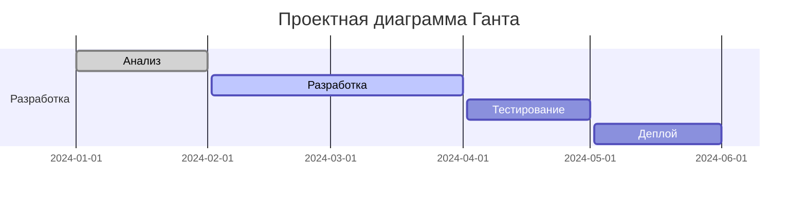

🔹 **Обозначения**:

- `title` — заголовок диаграммы.
- `dateFormat` — формат даты.
- `section` — раздел проекта.
- `:done` — завершенная задача.
- `:active` — текущая задача.

---

### **6. Pie Chart (Круговая диаграмма)**

Используется для отображения процентного соотношения данных.

📌 **Пример**:

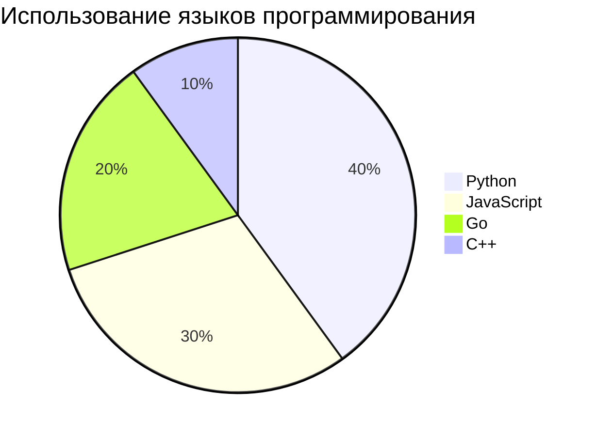

🔹 **Обозначения**:

- `title` — заголовок диаграммы.
- `"Название"` : `число` — категории и их значения.

---

### **7. ER Diagram (Диаграмма «Сущность-Связь»)**

Используется для моделирования структуры базы данных.

📌 **Пример**:

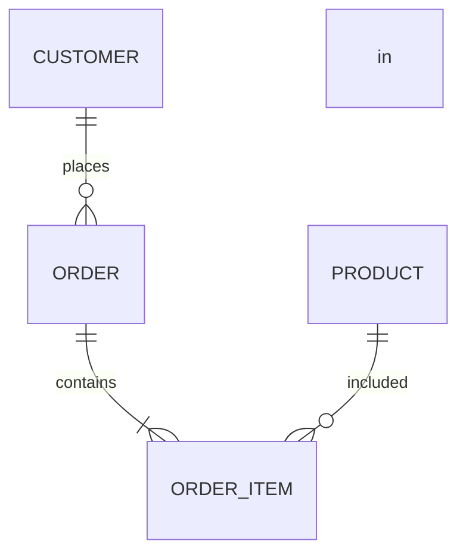

🔹 **Обозначения**:

- `||--o{` — связь один ко многим.
- `||--|{` — связь один ко многим (жесткая).
- `o{ -- o{` — связь многие ко многим.

---

### **Что значит начало файла?**

В Mermaid **не требуется** специальное начало файла. Ты просто указываешь тип диаграммы, например:

```
graph TD;
sequenceDiagram;
classDiagram;
```

Но если используешь **Markdown**, то Mermaid-код встраивается так:

````markdown
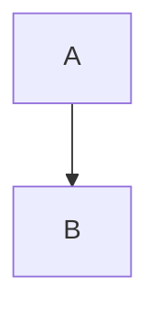
🔹 В этом случае важно, чтобы Mermaid **стоял внутри тройных кавычек** и был указан его тип.  

---

### **Какой инструмент использовать в VS Code?**
- **Mermaid.js встроен в GitHub и некоторые Markdown-просмотрщики.**  
- Для **VS Code** установи расширение [Markdown Preview Mermaid Support](https://marketplace.visualstudio.com/items?itemName=bierner.markdown-mermaid).  

💡 **Какой тип диаграмм тебе нужен?** 😊
```