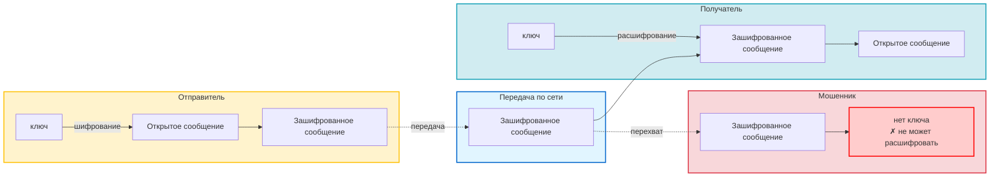
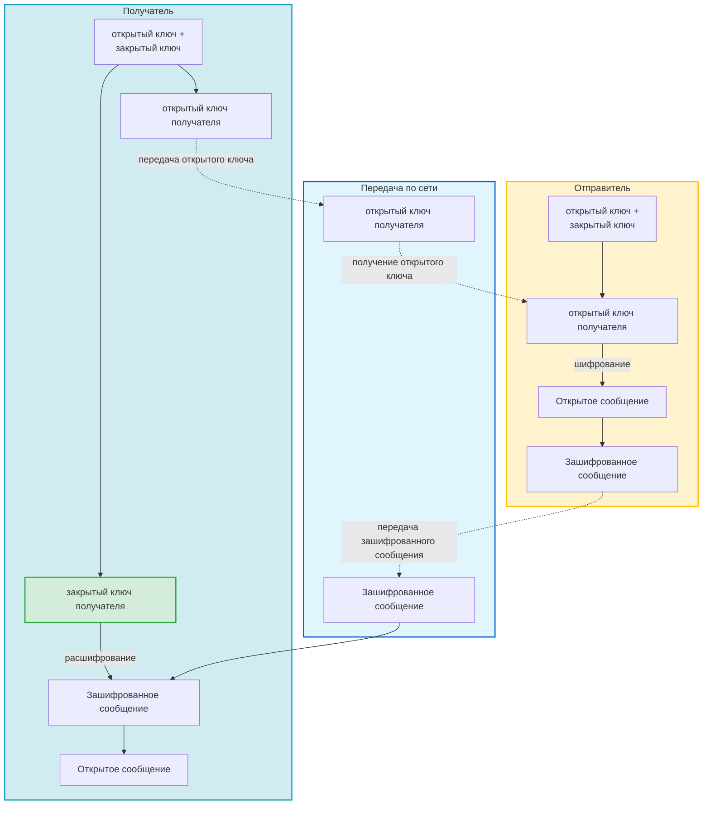
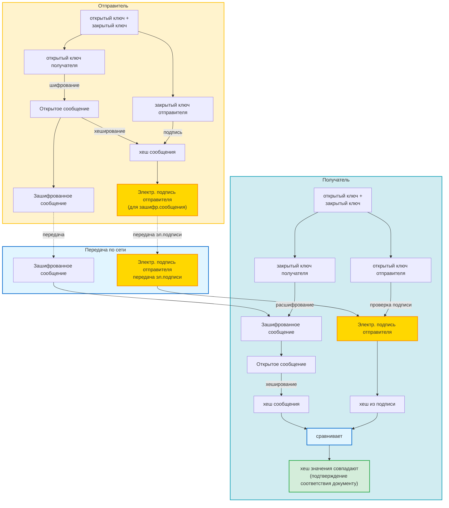

---
tags:
  - Саморазвитие
  - HTTP
  - HTTPS
  - API
  - Безопасность
  - конспект
created_at: 2025-11-10
updated_at:
---
# 8.10 Безопасность в сети. HTTPS

## Симметричное шифрование

**Шифрование** — преобразование информации, делающее её нечитаемой для посторонних.

### Определение

Симметричное шифрование использует **один и тот же ключ** для шифрования и расшифровки данных. Это быстрый процесс, подходящий для работы с большими объемами данных.

### Процесс работы

1. **Отправитель:**
   - Имеет открытое сообщение и ключ
   - Использует ключ для шифрования открытого сообщения
   - Получает зашифрованное сообщение

2. **Передача:**
   - По сети передается только зашифрованное сообщение
   - Ключ передается отдельно (по защищенному каналу)

3. **Получатель:**
   - Получает зашифрованное сообщение
   - Использует тот же самый ключ для расшифровки
   - Получает открытое сообщение

4. **Защита от перехвата:**
   - Мошенник может перехватить зашифрованное сообщение
   - Но не может расшифровать его, так как у него нет ключа

**Результат:** Симметричное шифрование решает проблему перехвата сообщения.

### Диаграмма симметричного шифрования

### Преимущества

- **Быстрое и эффективное** — один ключ для шифрования и дешифрования
- **Не требует больших мощностей** — низкие вычислительные затраты
- **Подходит для больших данных** — эффективно для больших объемов информации

### Недостатки

- **Риск перехвата ключа** — если ключ перехвачен, злоумышленник может расшифровать все сообщения
- **Риск потери ключа** — ключ общий, нужно безопасно передавать его получателю
- **Проблема распределения ключей** — сложность безопасной передачи ключа между сторонами

### Примеры использования

- **Файловое шифрование:** Программы для шифрования дисков и файлов, такие как BitLocker, часто используют симметричное шифрование
- **Сетевое шифрование:** Протоколы безопасности, такие как WPA2 для Wi-Fi, также применяют симметричные алгоритмы для защиты передаваемых данных
- **Архивы:** ZIP-архивы с паролем используют симметричное шифрование (пароль = ключ)

**Почему симметричное шифрование?** Оно требует меньше ресурсов, что делает его идеальным для ситуаций, где скорость и эффективность критичны, например, при шифровании больших данных в реальном времени.

### Важные моменты

- **Под ключом можно подразумевать просто пароль** (например, от архива ZIP)
- **Ключ должен передаваться по защищенному каналу** — это основная проблема симметричного шифрования
- **Если ключ скомпрометирован, все зашифрованные данные становятся уязвимыми**

---
## Асимметричное шифрование

**Асимметричное шифрование** использует **пару ключей**: открытый (public) и закрытый (private) ключ. Открытый ключ используется для шифрования, закрытый — для расшифровки.

### Определение

Асимметричное шифрование решает проблему распределения ключей симметричного шифрования. Каждая сторона имеет пару ключей: открытый ключ можно свободно распространять, закрытый ключ хранится в секрете.

### Принцип работы

**Основное правило:**
- **Зашифровать** можно только с помощью **открытого ключа**
- **Расшифровать** можно только с помощью **закрытого ключа**

### Процесс работы (отправитель → получатель)

1. **Получатель генерирует пару ключей:**
   - Создает закрытый ключ (хранит в секрете)
   - Создает открытый ключ (может свободно распространять)

2. **Получатель отправляет отправителю свой открытый ключ:**
   - Открытый ключ можно передавать по незащищенному каналу
   - Закрытый ключ никогда не передается

3. **Отправитель шифрует сообщение:**
   - Берет открытое сообщение
   - Использует открытый ключ получателя для шифрования
   - Получает зашифрованное сообщение

4. **Передача по сети:**
   - По сети передается только зашифрованное сообщение
   - Открытый ключ уже был передан ранее

5. **Получатель расшифровывает сообщение:**
   - Получает зашифрованное сообщение
   - Применяет свой закрытый ключ для расшифровки
   - Получает исходное открытое сообщение

**Обратная связь:** Если получатель хочет отправить зашифрованное сообщение отправителю, процесс аналогичен, но в обратную сторону — отправитель отправляет получателю свой открытый ключ.

### Диаграмма асимметричного шифрования

### Преимущества

- **Высокий уровень безопасности** — закрытый ключ никогда не передается по сети
- **Предпосылки для подтверждения личности** — можно использовать электронные подписи и идентифицировать конкретного пользователя
- **Не боимся потерять открытый ключ** — открытый ключ можно свободно распространять, он не является секретным
- **Решает проблему распределения ключей** — не нужно безопасно передавать секретный ключ

### Недостатки

- **Медленнее симметричного шифрования** — два ключа и более сложные алгоритмы требуют больше вычислительных ресурсов
- **Требует больших мощностей** — высокие вычислительные затраты
- **Сложнее в управлении ключами** — нужно следить, чтобы случайно не передать закрытый ключ вместо открытого
- **Непригодно для больших данных** — из-за низкой скорости не подходит для шифрования больших объемов данных

### Примеры использования

- **HTTPS/TLS** — для установления защищенного соединения
- **Электронная подпись** — для подтверждения авторства и целостности документов
- **PGP/GPG** — для шифрования электронной почты
- **SSH** — для безопасного удаленного доступа

### Важные моменты

- **Открытый ключ можно свободно распространять** — он не является секретным
- **Закрытый ключ никогда не передается** — хранится только у владельца
- **Каждая сторона имеет свою пару ключей** — для двусторонней связи нужны две пары ключей
- **Асимметричное шифрование медленнее симметричного** — поэтому часто используется гибридный подход

---

## HTTPS

**HTTPS (HyperText Transfer Protocol Secure)** — защищенная версия протокола HTTP, использующая шифрование для защиты данных.

### Гибридное шифрование

HTTPS использует **гибридное шифрование** — комбинацию симметричного и асимметричного шифрования:

1. **Асимметричное шифрование** используется для:
   - Установления защищенного соединения, чтобы снизить риск перехвата ключа
   - **Безопасной передачи симметричного открытого ключа**
   - ~~Аутентификации сервера (через SSL/TLS сертификаты)~~

1. **Симметричное шифрование** используется для:
   - **Шифрования основного трафика данных**
   - ~~Обеспечения высокой скорости передачи~~

~~**Процесс:**~~
1. ~~Клиент и сервер устанавливают соединение через асимметричное шифрование~~
2. ~~Сервер передает клиенту симметричный ключ, зашифрованный открытым ключом клиента~~
3. ~~Далее весь трафик шифруется симметричным ключом для скорости~~

**Преимущества гибридного подхода:**
- Безопасность асимметричного шифрования
- Скорость симметричного шифрования
- Оптимальный баланс между безопасностью и производительностью

----
**Асимметричное шифрование**

Асимметричное шифрование, или шифрование с открытым ключом, использует пару ключей: публичный ключ для шифрования и частный ключ для расшифровки. Это позволяет пользователям безопасно обмениваться данными, даже если они заранее не обменивались секретным ключом.

Примеры использования:

- Цифровые подписи: Для подписания документов и программного обеспечения, подтверждая их подлинность и целостность.
    
- Обмен шифрованными сообщениями: Протоколы, такие как TLS/SSL, используемые для защиты передачи данных в интернете, например, при совершении покупок онлайн или работы с банковскими сервисами.
    

Почему? Асимметричное шифрование обеспечивает удобный и безопасный способ обмена ключами между пользователями, которые никогда не встречались, и позволяет устанавливать безопасные соединения без необходимости предварительного обмена секретными ключами.

**Детский пример для понимания работы ассиметричного шифрования**

Представь, что у тебя есть волшебная книга для раскраски, и ты хочешь отправить свой рисунок другу по имени Саша. Но ты хочешь, чтобы только Саша мог увидеть твой рисунок, а никто другой.

Волшебные раскраски (публичный открытый ключ)

- Саша отправляет тебе волшебные раскраски. Эти раскраски особенные: всё, что ты раскрашиваешь ими, может увидеть только Саша с помощью волшебных очков. Ты можешь рассказать о волшебных раскрасках всем в классе, и даже они могут их использовать, чтобы рисовать для Саши, но это не страшно, потому что только Саша сможет увидеть рисунки.
    

Твой рисунок (сообщение которое нужно передать)

- Ты берешь волшебные раскраски и рисуешь самый лучший рисунок для Саши. Ты стараешься, чтобы он получился ярким и красочным.
    

Волшебные очки (частный закрытый ключ)

- У Саши есть волшебные очки, которые позволяют ему видеть то, что нарисовано волшебными раскрасками. Когда ты отправляешь свой рисунок Саше, только он может надеть свои волшебные очки и увидеть, что ты нарисовал. Никто другой в мире не имеет таких же очков, поэтому никто, кроме Саши, не сможет увидеть твой рисунок, даже если очень захочет.
    

Таким образом, волшебные раскраски — это как публичный ключ, которым можно делиться с кем угодно, чтобы они могли отправлять зашифрованные сообщения (в нашем случае рисунки) Саше. А волшебные очки — это как частный ключ, который есть только у Саши и который позволяет ему расшифровывать (или "видеть") сообщения. Это и есть суть асимметричного шифрования: позволять людям безопасно делиться секретами, даже если они никогда не встречались, чтобы обменяться специальным секретом (ключом).

**Пример реального ассиметричного алгоритма (диффи-хеллмана) для обмена симметричным ключом**

Представь, что теперь ты и Саша хотите создать свой секретный язык (симметричный ключ), чтобы общаться так, чтобы никто другой не мог понять вашу переписку. Но есть проблема: как передать этот секретный язык друг другу, не встречаясь лично и не допуская, чтобы кто-то другой его узнал?

Здесь на помощь приходят волшебные семена, которые вы оба решаете использовать, чтобы вырастить волшебное растение в вашем секретном саду.

Шаг 1: Волшебные семена (общий секрет)

- Вы оба соглашаетесь использовать одинаковые волшебные семена. Это как общая основа алгоритма Диффи-Хеллмана, которая будет известна обоим участникам, но не способна создать полный секрет сама по себе.
    

Шаг 2: Волшебная земля и удобрения (приватные числа)

- Затем, каждый из вас выбирает своё секретное удобрение для земли, в которой будут расти семена. Это ваш личный вклад в создание секретного языка, который никто другой не знает. Вы не говорите друг другу, какое удобрение выбрали.
    

Шаг 3: Обмен волшебными растениями (обмен данными)

- После того как вы посадили волшебные семена в свою землю и добавили удобрение, у вас растут волшебные растения. Теперь вы обмениваетесь этими растениями между собой. Несмотря на то, что кажется, будто вы обменялись секретами, на самом деле, вы только показали результат своих усилий, но не раскрыли свои уникальные удобрения.
    

Шаг 4: Выращивание финального волшебного растения (создание симметричного ключа)

- Теперь, получив растение друг от друга, каждый из вас сажает это новое растение в свою землю с тем же секретным удобрением, что и раньше. В результате у каждого из вас растёт новое одинаковое волшебное растение, несмотря на то, что вы использовали разные удобрения.
    

Это финальное растение — ваш секретный язык (симметричный ключ), который теперь у вас обоих одинаковый, и вы можете использовать его для шифрования и расшифровки ваших сообщений. Никто другой не сможет вырастить такое же растение, потому что они не знают ваше секретное удобрение, даже если видели растение, которое вы обменивали.

На самом деле всё чудо заключается в математике (пример создания сим.ключа между Алисой и Бобом):

(В следующем уроке мы подробнее разберём работу HTTPS).

**В протоколе HTTPS используется гибридное шифрование, чтобы обеспечить безопасность данных, передаваемых между браузером пользователя и сервером. Гибридное шифрование сочетает в себе преимущества симметричного и асимметричного шифрования, используя их для разных задач в процессе установления защищённого соединения.**

Как работает гибридное шифрование в HTTPS:

1. Асимметричное шифрование для обмена ключами: Когда вы заходите на сайт, использующий HTTPS, ваш браузер и сервер начинают процесс рукопожатия TLS (Transport Layer Security). В рамках этого процесса сначала используется асимметричное шифрование для безопасного обмена симметричными ключами. Ваш браузер получает открытый ключ сервера, содержащийся в сертификате безопасности, проверяет его подлинность, а затем использует этот ключ для шифрования и отправки серверу сгенерированного симметричного ключа.
    
2. Симметричное шифрование для передачи данных: После того как симметричный ключ безопасно передан и получен обеими сторонами, вся последующая передача данных между браузером и сервером происходит с использованием симметричного шифрования. Это обеспечивает высокую скорость и эффективность, поскольку симметричное шифрование требует меньше вычислительных ресурсов по сравнению с асимметричным.
    

Почему используется гибридное шифрование?

1. Безопасность асимметричного шифрования: Асимметричное шифрование обеспечивает безопасный обмен ключами даже через небезопасные каналы. Благодаря использованию пары ключей (открытый и закрытый) и сертификатов SSL/TLS, обеспечивается аутентификация сервера и защита ключа от перехвата.
    
2. Эффективность симметричного шифрования: После обмена ключами для всей последующей передачи данных используется симметричное шифрование. Это позволяет значительно увеличить скорость работы протокола по сравнению с использованием только асимметричного шифрования, так как симметричное шифрование более быстрое и менее требовательное к ресурсам.

---
## Электронная подпись

А что если отправитель говорит, что ничего не отправлял получателю.
Электронная подпись решает проблему отрицания. 

Принцип работы:
1. От открытого сообщения отправителя берется хэш сообщения, цифровой отпечаток
2. Эта строка шифруется закрытым ключом отправителя - и получили электронную подпись для закрытого сообщения
3. и вместе с передачей зашифрованного сообщения передаем электронную подпись сообщения
4. Получатель получает зашифрованный файл и с помощью закрытого ключа получателя расшифровывает
5. И хочет решить проблему отрицания: 
	1. берет электронную подпись и с помошью открытого ключа отправителя расшифровывает сообщение и получает хэш сообщения
	2. И с зашифрованного сообщения тоже может получить хэш 
	3. сравнивает два хэша и если они равны то убеждается что автор правильный

Механизм электронной подписи можно использовать и по HTTP

У электронной подписи используются отдельные ключи

### Диаграмма электронной подписи

### Откуда появляется электронная подпись
Отправитель хочет иметь эп чтобы иметь возможность отправлять документы и они верили что документы от него и они подлинны

Он идет в центр регистрации который имеет лицензию на выдачу ЭП

Центр регистрации идет с данными в центр сертификации о том что нужно выдать сертификат
Выдает сертификат и отктытый ключ 
и закрытый ключ

У отправителя появились ключи

Отправитель отправляет документ с ЭП
Отправляет сертификат с открытым ключом

получатель может с открытым ключом получить хэш, взять хэш сообщения и сравнить. 

Есть еще одна проблема: а что если подпись подделана, перехвачена или недействительна. 
Как решают - есть центр сертификации, он отправляет список недейств сертификатов в рееест 
и мы 7 шагом можем отправить сертификат и проверить что он действителен

![[Pasted image 20251110195815.png]]

---
### Подробнее про электронную подпись (ЭП)

**В РФ бывает три вида подписи:**

- Простая электронная подпись (ПЭП) представляет собой уникальный цифровой идентификатор, который можно использовать для подтверждения личности онлайн, например, при регистрации на сайте или подтверждении банковских транзакций через СМС-коды или логин и пароль.  
    Этот вид подписи доступен при регистрации на различных веб-платформах, в приложениях, таких как Microsoft Office или «КриптоПро» CSP, и может быть получен в удостоверяющих центрах.  
    Особенностью ПЭП является её ограниченная юридическая сила, которая активируется только при наличии законодательного основания или соглашения сторон. Хранение такой подписи не требует специализированных условий и может осуществляться на любом электронном носителе.
- Усиленная неквалифицированная электронная подпись (НЭП) обеспечивает более высокий уровень защиты данных благодаря использованию криптографических методов. Она подтверждает не только личность подписавшего, но и то, что документ не был изменён после подписания.  
    Получить НЭП можно на сайте ФНС или в удостоверяющем центре. НЭП может храниться как на сервере ФНС, так и на любом физическом носителе.
- Квалифицированная электронная подпись (КЭП) является самым надёжным типом ЭП, равносильным ручной подписи на бумажном носителе. Она гарантирует юридическую силу подписанным электронным документам и их защиту от изменений.  
    Ключи для КЭП создаются с использованием специализированного программного обеспечения, прошедшего сертификацию. КЭП можно оформить в аккредитованных удостоверяющих центрах, а хранение происходит на специальных защищённых носителях, таких как токены.

***К 2024 процесс получения подписи поменялся, на предыдущем шаге схема работы с центрами сертификации может быть обновлена.

На предыдущем шаге мы говорили про механизм работы подписи КЭП. Обычная подпись ПЭП часто используется при регистрации в банках, она (подпись) привязывается к вашему номеру телефона и именно поэтому код из смс срабатывает как механизм подтверждения что именно вы хотите войти в банк\совершить операцию.

**Использование КЭП гарантирует:**

- Аутентичность (подтверждение авторства документа)
    
- Целостность (гарантия отсутствия изменений в документе после подписания)
    
- Неотказуемость (автор не может отрицать факт подписания документа).
    

**Давайте рассмотрим весь процесс создания, отправки и проверки документа, подписанного квалифицированной электронной подписью (КЭП), от начала до конца, используя в качестве примера программу "КриптоПро CSP" для работы с электронной подписью.**

- Подготовка документа бухгалтером А

Бухгалтер А подготавливает документ, который необходимо отправить бухгалтеру Б. Это может быть любой тип документа, требующий подтверждения подлинности и целостности, например, финансовый отчет.

- Создание электронной подписи

1. Генерация хеш-суммы: Бухгалтер А использует программу "КриптоПро CSP" для генерации хеш-суммы из документа. Хеш-сумма — это уникальная последовательность символов, получаемая в результате преобразования исходного текста документа специальным алгоритмом.
    
2. Подписание хеш-суммы: Затем бухгалтер А использует свой закрытый ключ, хранящийся на защищенном носителе (например, на специальном токене), чтобы зашифровать хеш-сумму, превращая ее в электронную подпись. Это действие также выполняется с помощью "КриптоПро CSP".
    

- Отправка документа и подписи бухгалтеру Б

Бухгалтер А отправляет электронный документ вместе с файлом электронной подписи бухгалтеру Б.

- Проверка документа бухгалтером Б

1. Получение и проверка сертификата подписи: При получении документа и подписи бухгалтер Б сначала проверяет сертификат подписи, который содержит открытый ключ бухгалтера А и подтверждает его личность.  
    Для этого бухгалтер Б может использовать "КриптоПро CSP", который позволяет проверить, выдан ли сертификат доверенным удостоверяющим центром и не истек ли срок его действия, и что документ действительно от бухгалтера А.
    
2. Расшифровка и проверка хеш-суммы: Далее бухгалтер Б использует открытый ключ из сертификата для расшифровки электронной подписи и получения из нее исходной хеш-суммы. После этого "КриптоПро CSP" генерирует новую хеш-сумму из полученного документа и сравнивает ее с расшифрованной хеш-суммой из подписи.
    
3. Подтверждение подлинности и целостности: Если хеш-суммы совпадают, это подтверждает, что документ не был изменен после подписания и подпись действительно принадлежит бухгалтеру А. Это гарантирует целостность и подлинность документа.