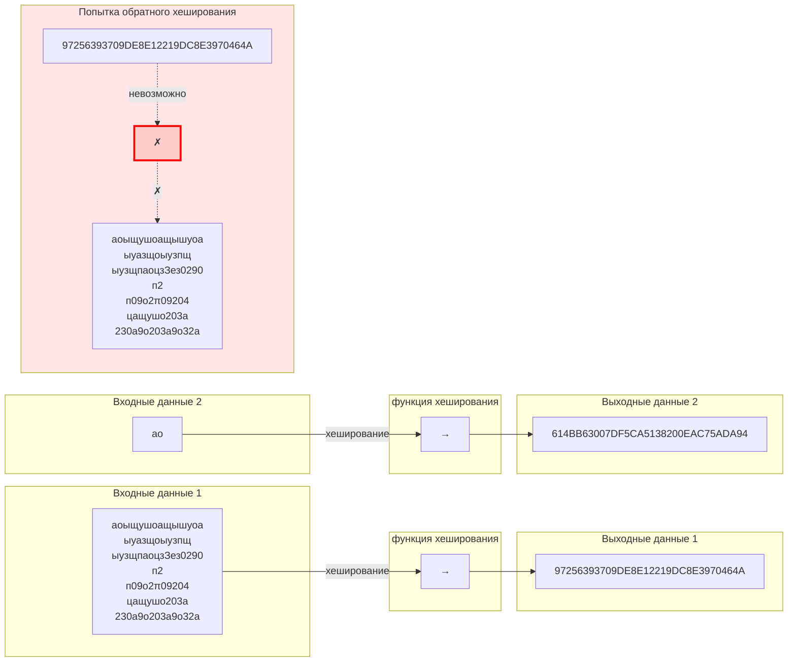
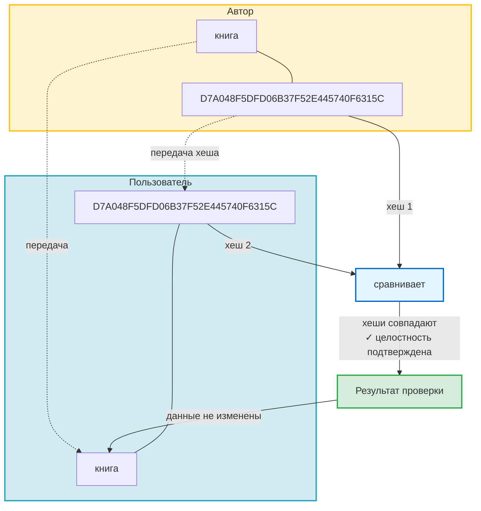
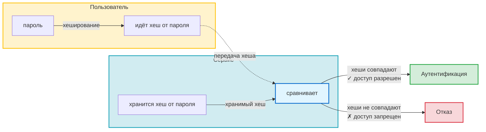

---
tags:
  - Саморазвитие
  - HTTP
  - HTTPS
  - API
  - Безопасность
  - конспект
  - Хеширование
  - Хеш
  - Пароли
  - Целостность_данных
created_at: 2025-11-10
updated_at:
---
# 8.10 Безопасность в сети. хеши, ключи, подпись
## Хэширование
процесс преобразования входных данных любого размера в строку фиксированной длины (хеш). Этот процесс необратим, то есть вы не можете восстановить исходные данные из хеша.

Цель: исключить возможность подбором текста узнать исходное значение хэш функции

### Диаграмма хеширования

## Решение проблемы целостности

Хеширование решает проблему целостности данных. Можно применять к любым данным.

### Пример: проверка целостности книги

**Сценарий:** Пользователь скачивает книгу с сайта и хочет убедиться, что файл не был изменен или поврежден при передаче.

**Процесс:**
1. Автор публикует книгу и вычисляет её хеш
2. Пользователь скачивает книгу и получает хеш от автора
3. Пользователь вычисляет хеш скачанной книги
4. Сравнивает полученный хеш с хешем от автора
5. Если хеши совпадают → книга оригинальная и не изменена
6. Если хеши не совпадают → данные были изменены или повреждены

**Результат:** Убеждаемся в целостности и сохранности данных.

### Диаграмма проверки целостности

## Хеширование паролей

Хеширование паролей решает проблему безопасности при аутентификации пользователей.

Пример: 
Ваш пароль "password123" после хеширования алгоритмом MD5 превращается в "482c811da5d5b4bc6d497ffa98491e38". Невозможно узнать исходный пароль, имея хеш.
### Принцип работы

**Проблема:** Хранение паролей в открытом виде небезопасно. При утечке базы данных злоумышленник получает доступ ко всем паролям.

**Решение:** Хранить только хеш пароля, а не сам пароль.

### Процесс аутентификации

1. **Регистрация:**
   - Пользователь вводит пароль
   - Система вычисляет хеш от пароля
   - В базе данных сохраняется только хеш пароля

2. **Вход в систему:**
   - Пользователь вводит пароль
   - Система вычисляет хеш от введенного пароля
   - Система сравнивает вычисленный хеш с хешем, хранящимся в базе данных
   - Если хеши совпадают → аутентификация успешна
   - Если хеши не совпадают → доступ запрещен

**Преимущества:**
- Пароль никогда не передается и не хранится в открытом виде
- Даже при утечке базы данных злоумышленник не получит исходные пароли
- Сравнение происходит только по хешам

### Диаграмма хеширования паролей

### Важные моменты

- **Никогда не хранить пароли в открытом виде** — только хеши
- **Использовать криптографически стойкие алгоритмы хеширования** (SHA-256, bcrypt, Argon2)
- **Добавлять соль (salt)** для защиты от rainbow tables атак
- **Пароль не передается по сети** — передается только его хеш

---
### Основные термины

**Хеширование**  
процесс преобразования входных данных любого размера в строку фиксированной длины (хеш). Этот процесс необратим, то есть вы не можете восстановить исходные данные из хеша.

Пример:  
Ваш пароль "password123" после хеширования алгоритмом MD5 превращается в "482c811da5d5b4bc6d497ffa98491e38". Невозможно узнать исходный пароль, имея хеш.

**Шифрование**

процесс преобразования информации в зашифрованный вид с помощью алгоритма шифрования и ключа, который делает содержимое недоступным для неавторизованных лиц. Шифрование обратимо, то есть информацию можно расшифровать обратно в исходное состояние, но только с использованием соответствующего ключа.

Пример:  
Вы шифруете сообщение "Привет" с помощью ключа, и оно превращается в "87x6E". С помощью того же ключа сообщение можно расшифровать обратно в "Привет".

**Кодирование**

процесс преобразования данных из одной формы в другую, обычно с целью передачи или хранения данных в определённом формате. Кодирование обратимо, и основная цель — сохранение формата данных, а не их секретность.

Пример:  
Текст "Привет" кодируется в формате ASCII как последовательность чисел "80 114 105 118 101 116", которые представляют символы исходного сообщения. Эти данные могут быть декодированы обратно в текст "Привет".

Итог:

- Хеширование используется для проверки целостности данных и не позволяет восстановить исходное сообщение. Хеши уникальны для каждого набора данных.
    
- Шифрование предназначено для защиты конфиденциальности данных, позволяя их восстановление только при наличии соответствующего ключа.
    
- Кодирование обеспечивает совместимость данных между различными системами или компонентами, позволяя легко преобразовывать данные обратно в их исходный формат.