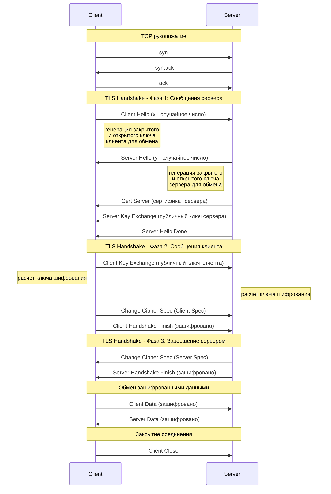

---
tags:
  - Саморазвитие
  - HTTP
  - HTTPS
  - API
  - Безопасность
  - TCP
  - TLS
created_at: 2025-11-10
updated_at:
---
# 8.11 HTTPS - изучаем каждую деталь

HTTPS - это HTTP поверх протокола TLS

**Стек протоколов:**
- HTTP
- TLS (на прикладном уровне превращает HTTP в HTTPS)
- TCP
- IP

HTTP использует порт 80, HTTPS - 443

Современная версия - TLS 1.3

## TLS 1.2

### 0. TCP рукопожатие

Сначала идет TCP рукопожатие:
1. Клиент отправляет `syn`
2. Сервер отправляет `syn-ack`
3. Клиент отправляет `ack`

### 1. Установка TLS

**Фаза 1: Сообщения сервера**

1. **Client Hello** - Клиент отправляет сообщение серверу `Client Hello` с версиями протокола и своим случайным числом `x`
2. **Server Hello** - Сервер генерирует число `y` и отправляет `Server Hello`
3. **Cert Server** - Сервер отправляет сертификат, чтобы клиент мог убедиться в подлинности сервера
4. **Генерация ключей сервера** - Сервер с помощью случайных чисел генерирует открытый и закрытый ключ сервера для обмена
5. **Server Key Exchange** - Клиент получает публичный ключ сервера
6. **Server Hello Done** - Сервер завершает свою часть handshake

**Фаза 2: Сообщения клиента**

7. **Генерация ключей клиента** - Клиент имеет числа `x` и `y`, с их помощью может сгенерировать публичный и приватный ключи клиента
8. **Client Key Exchange** - Клиент серверу отправляет публичный ключ клиента
9. **Расчет симметричного ключа** - Клиент и сервер рассчитывают симметричный общий ключ шифрования, не обмениваясь закрытыми ключами
10. **Change Cipher Spec (Client)** - Клиент отправляет `Client Spec`, сигнализируя о переходе на шифрование
11. **Client Handshake Finish** - Клиент отправляет `Client Handshake Finish` (первое зашифрованное сообщение)

**Фаза 3: Завершение сервером**

12. **Change Cipher Spec (Server)** - Сервер получает, расшифровывает и отправляет `Server Spec`
13. **Server Handshake Finish** - Сервер отправляет `Server Handshake Finish`

**Фаза 4: Обмен данными**

14. **Application Data** - Клиент отправляет зашифрованные данные (например, ping)
15. **Application Data** - Сервер отправляет зашифрованные данные (например, pong)

### Диаграмма TLS 1.2 Handshake

![[Pasted image 20251110201930.png]]

## TLS 1.3
0. TCP
	1. 
1. Клиент генерит число x , открытый и закрытый ключ, Client hello
2. сервер получает число х и публичный клюс, генерит число у
3. Сервер рассчитывает общий ключ шифрования
4. Сервер отправляет Сервер хелло + число у
5. клиент получает все и рассчитывает общий ключ и расшифровывает инфу о сертификате
6. клиент отправляет пинг
7. сервер отправляет понг

Есть функция быстрого восстановления соединения