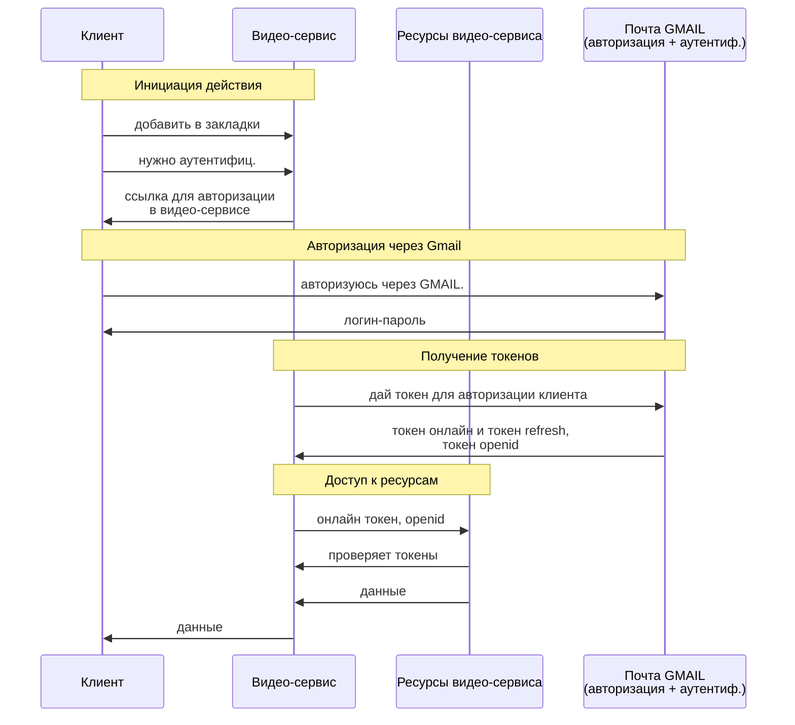

---
tags:
  - Саморазвитие
  - HTTP
  - HTTPS
  - API
  - Безопасность
  - oAuth2
  - jwt
  - Аутентификация
  - Авторизация
  - API-Key
  - mTLS
  - RBAC
  - ABAC
  - MAC
  - CBAC
  - OpenID_Connect
created_at: 2025-11-10
updated_at:
---
# 8.13 Аутентификация и авторизация: api-key, токены, mtls, jwt, oAuth2

1. Когда входим в сервис, он сначала идентифицирует. Сначала через логин

2. Тогда он хочет убедиться что это тот пользователь. аутентификация. проверка пароля, сверяет пароль

3. Далее авторизация. Выдача прав на выполнение опред действий

Может быть авторизация без идентификации и аутентификации. Например общее хранилище файлов. Каждый пользователь у которого есть ссылка, может прочитать файл

## Виды аутентификации

### Basic

1. Есть метод GET api.com, его вызываем
2. метод отвечает 401 неавторизован, добавляет заголовок WWW-Authenticate: Basic
3. Повторная попытка:
	1. вводим логин=login1 и пароль=qwerty
	2. логин/пароль в login1:qwerty, кодируем в base64 = aferkjsdkfj
	3. добавляем заголовок Authorization: Basic aferkjsdkfj
	4. Вызываем GET api.com, и передаем заголовок
	5. Сервис дает 200 ок

Минус: 
- слабая безопасность потому что данные передаются в открытом виде
- сложность управления сессией, потому что каждый раз надо передавать заголовок и клиент может кэшировать. Сервер не очень гибко управляет сессией
	- Один из методов: очистить кэш на клиенте
Плюсы:
- быстрая и простая реализация

### API-Key
onlinesim.io

1. сервис выдает уникальный ключ
2. этот ключ в запросах АПИ использует клиент

Помимо квери параметра можно его писать в спец заголовок
Ключ заголовка x-Api-key

Плюсы:
- метод прост и подходит для разработчиков

Минусы:
- тяжело разделять права доступа по ключам., сложность авторизации. Обычно есть ко всем методам по одному апи ключу. 
- Риски безопасности

### Cookie
Использует заголовки куки для аутентификацмм

1. Клиент с помощью Basic аутентифицировля в сервисе
2. Сервер отвечает заголовком Set-Cookie, указывает какой заголовок клиент должен установить. Допустим Set-Cookie: SESSIONID=kfdgjksdgk; Path=/; HttpOnly
3. Клиент в следующих запросах отправляет заголовок Cookie: SESSIONID=kfdgjksdgk
4. Если клиент не отправит заголовок то перенаправляет клиента

Плюсы:
- позволяет гибко управлять сессией. Например сделать метод логаут, который будет разлогинивать клиента и удалять сессию (выход+ограничение по времени сессии)
- гибкость авторизации. В куки можно добавлять зашифрованные параметры типа должности чтобы определять к каким данным имеет доступ и к каким не имеет

Минус:
- Нужно хранить сессию клиента, нарушаем принцип steteless, т.к. сервер сохраняет инфо о сессии

### Сертификаты mTLS
Есть сервер 1 и сервер 2

1. Сервер 1 хочет установить защищенное соединение,
2. сервер 2 просит сертификат и отправляет свой серт серверу 1
3. сервер 1 проверяет серт 2 и отправляет серт1 серверу 2
4. Сервер 2 проверяет и: ОК, давай общаться

Обычно такой уровень не нужен между клиентом и сервером, потому что каждому клиенту нужно выпускать сертификаты. 

Плюсы:
- Серьезный уровень безопасности. Допустим клиент не может притвориться сервером 1 чтобы обратиться к серверу 2
Минусы:
- сложная и дорогая реализация
- сложно управлять сертификатами
- Не каждый клиент сможет поддерживать такое

  
Сертификат mTLS выглядит, как и обычный сертификат TLS. Он также содержит такую информацию, как:

Субъект — кому выдан сертификат. Это может быть человек, организация или устройство.  
Эмитент — центр сертификации (ЦС), который проверил и выдал сертификат.  
Срок действия — дата выдачи и дата истечения срока действия сертификата.  
Открытый ключ — ключ, связанный с субъектом сертификата, используемый для шифрования и цифровой подписи.  
Алгоритм подписи — криптографический алгоритм, используемый для подписи сертификата эмитентом.  
Серийный номер — уникальный номер, присваиваемый эмитентом для отличия сертификата от других.  
Расширения — дополнительная информация о сертификате и его использовании, например, альтернативные имена субъектов (SAN) или ограничения на использование ключей.

Вот пример того, как может выглядеть сертификат в виде обычного текста (формат PEM, это текст в base64):  
-----BEGIN CERTIFICATE-----  
MIIDXTCCAkWgAwIBAgIJAJC1HiIAZAiIMA0GCSqGSIb3DQEBCwUAMEUxCzAJBgNV  
BAYTAkFVMRMwEQYDVQQIDApTb21lLVN0YXRlMSEwHwYDVQQKDBhJbnRlcm5ldCBX  
aWRnaXRzIFB0eSBMdGQwHhcNMTcwMzEwMTg1OTM3WhcNMTgwMzEwMTg1OTM3WjBF  
……………………….  
-----END CERTIFICATE-----

![[Pasted image 20251110212622.png]]
### Bearer token
1. Клиент с помощью Basic аутентифицировался в сервисе
2. Сервис выдает клиенту токен: в теле, в заголовке или в куках
3. Клиент следующие запросы вызывает с заголовком Authorization: Bearer {token}

Плюсы:
- гибкое управление сессией (выход+время жизни токена)
- гибкая авторизация, так как в токен можно зашифровать инфу о пользователе, которая позволит гибко выдавать права

Минусы:
- Нужно хранить состояние на сервере

Есть еще случаи, когда сервис выдает два токена:
1. для использования online. Чтобы выполнял запросы и получал данные с сервиса определенное время
2. для получения нового токена - refresh. 

Допустим Первый токен просрочен
1. Отправляет запрос GET / token на получение нового токена с рефрешем
В любое время можем поменять/отозвать онлайн и рефреш токены

### JWT токен
клинент с помощью basic auth аутентифицировался в сервисе
сервис выдает клиенту два токена - один для использования, второй для получения нового токена
Клиент следующие запросы вызывает с заголовком Authorization: Bearer JWTtoken

jwt.io

Состоит из 3 частей
1. Заголовок: Алгоритм шифрования и тип токена
2. Payload позволяет получить например имя и когда выпущен токен, любые другие параметры в формате джсон. Все что позволит выдавать или ограничивать права
3. ДЛя проверки валидности подписи. Если обладаем другим секретом

Плюсы:
1. Stateless. Можно не хранить никакую информацию чтобы аутентифицировать клиента
2. Междоменная совместимость: если появляется новый сервис, можем поделиться закрытым ключом и таким образом сервис 2 быстро подхватывает все процессы
3. Гибкая авторизация: можем выдавать и ограничивать права
4. Усиленная безопасность

Минусы:
- сложная реализация
- большие ресурсы на разработку
- нагрузка на сеть, т.к. токен может быть большим
- ограниченное время жизни токена

## Виды авторизации
### RBAC
На основе ролей
Назначение ролей на основе обязанностей или функций

Минусы:
- Нужно четко придумать разраничения ролей
### ABAC
На основе атрибутов, свойств пользователя. 
АТрибуты тоже можно зашивать в JWT токен

### MAC

### CBAC
На основе контекста. Допустим зашел с другого устройства. 

## Виды авторизации
### oAuth
1. Клиент зашел на видео сервис и хочет загрузить контент на видео сервис
2. Видео сервис говорит сначала нужно аутентифицироваться и отправляет ссылку на сервис например Gmail
3. Клиент переходит по ссылке и предоставляет данные для Gmail
4. Gmail отправляет клиенту ссылку для авторизации в видео-сервисе. Все за счет редиректов
5. КЛиент автоматически переходит по ссылке в видео сервис и сообщает что авторизуется через Gmail
6. Видеосервис идет самостоятельно в гмаил для видео сервиса и запрашивает токен для авторизации клиента
7. Gmail возвращает JWT  токены онлайн и рефреш

У видео сервиса есть ресурсы
1. Видео сервис отправляет запросы в ресурсы запросы с онлайн токеном
2. Ресурсы проверяют токены в сервисе Gmail
3. Ресурсы возвращают видео сервису
4. видео сервис возвращает данные клиенту

Делегируется авторизация

#### Диаграмма OAuth и OpenID Connect

Плюсы: 
- повышенная безопасность
- пользователю не нужно регистрироваться
- стандартизация

Минусы:

На основе этого можно сделать SSO, с единственной разницей что сервис находится внутри организации
  
Вы наверняка уже использовали oauth2, не зная об этом. На многих сайтах (например adidas) есть возможность входа через Google. Но почему мы говорим, что oauth2 — это только протокол авторизации? Потому что никакой аутентификации на сайте adidas не происходит. Вы аутентифицируетесь один раз — в Google, а он уже выдает права на действия с вашим аккаунтом сайту adidas. Иногда это происходит и без вашего участия, например, если adidas будет добавлять информацию о покупках, которые вы сделали в оффлайн магазине.  
По сути происходит делегирование авторизации, oauth2 и описывает этот протокол делегирования.

OpenID предназначен для аутентификации — чтобы понять, что конкретный пользователь является тем, кем представляется. Например, с помощью OpenID Adidas понимает, что зашедший пользователь — именно вы с аккаунтом Google.